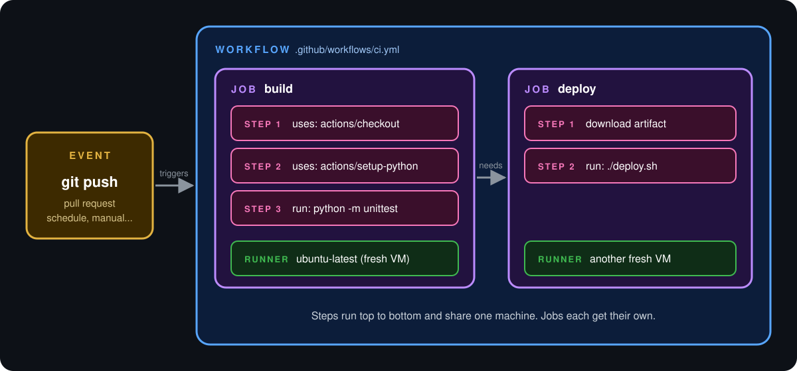
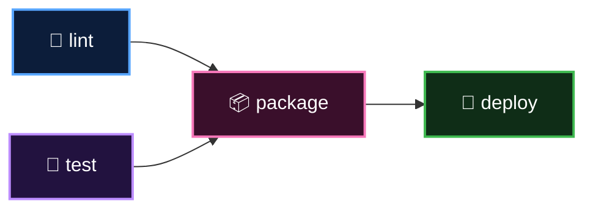

<p align="center">
  <b>Lesson 2 of 5</b> &nbsp;·&nbsp; ⏱️ 8 min read &nbsp;·&nbsp; 🟢 Beginner
</p>

# 🧩 The Six Core Concepts

Learn six words and you can read any workflow on GitHub. Here they are in one picture:

<p align="center">
  
</p>

And in one sentence:

> An **event** triggers a **workflow**, which contains **jobs**, which are made of **steps**, which either run a command or use an **action**, all on a **runner**.

Let's take them one at a time, from the outside in.

## 🔔 1. Event: the trigger

An event is *something that happened*. It's the reason a workflow starts.

```yaml
on: push
```

| Kind | Examples |
|---|---|
| 📝 Code activity | `push`, `pull_request` |
| 🗂️ Repository activity | `issues`, `release`, `fork` |
| ⏰ A clock | `schedule` (cron syntax) |
| 🔘 A human | `workflow_dispatch` (the "Run workflow" button) |
| 🔗 Another workflow | `workflow_call`, `workflow_run` |

📎 A fuller menu lives in [assets/snippets/triggers.yml](../assets/snippets/triggers.yml).

## 📜 2. Workflow: the recipe

A workflow is one YAML file in `.github/workflows/`. It names the events it listens for and the jobs to run when they fire.

- One repository can have **many** workflows (one for tests, one for deploys, one for issue triage)
- Each time a workflow is triggered, you get a **workflow run** with its own logs and its own ✅ or ❌

## 📦 3. Job: a unit of work on one machine

A job is a group of steps that run **on the same runner**.

Two rules to memorise:

> [!IMPORTANT]
> 1. **Jobs run in parallel by default.** Add `needs:` to put them in order.
> 2. **Jobs do not share files.** Each one starts on a brand-new machine.



Here `lint` and `test` run side by side, `package` waits for both, and `deploy` waits for `package`. The YAML for exactly this shape is in [assets/snippets/job-dependencies.yml](../assets/snippets/job-dependencies.yml).

## 👣 4. Step: one thing at a time

Steps are the individual tasks inside a job. They run **in order, top to bottom**, and because they share a runner, they share its files. Step 1 checks out the code, so step 2 can test it.

If a step fails, the remaining steps are skipped and the job is marked ❌.

A step does exactly one of two things:

```yaml
steps:
  - uses: actions/checkout@v7          # use an action
  - run: python -m unittest discover   # run a command
```

## 🧱 5. Action: a reusable building block

An action is packaged logic that someone already wrote so you don't have to. You call it with `uses:`.

```yaml
- uses: actions/setup-python@v7
  with:
    python-version: '3.13'
```

Read the reference like an address:

```text
actions / setup-python @ v7
   │           │          │
 owner       repo      version
```

Thousands of actions are published on the [GitHub Marketplace](https://github.com/marketplace?type=actions): log in to a cloud, send a Slack message, publish to npm.

> [!WARNING]
> **Naming trap.** The product is called GitHub Action**s**. An **action** is one reusable building block inside it. A workflow is *not* an action. When someone says "I wrote an action", ask which they mean.

> [!CAUTION]
> An action is someone else's code running with access to your repository. Prefer actions from owners you trust, and always pin a version (`@v7`), never a moving branch like `@main`.

📎 Side-by-side comparison: [assets/snippets/run-vs-uses.yml](../assets/snippets/run-vs-uses.yml)

## 🖥️ 6. Runner: the machine

A runner is the computer that executes a job.

| | GitHub-hosted | Self-hosted |
|---|---|---|
| Who maintains it | GitHub | You |
| State | Fresh VM per job, destroyed after | Whatever you left on it |
| Labels | `ubuntu-latest`, `windows-latest`, `macos-latest` | Your own |
| Best for | Almost everyone, to start | Special hardware, private networks |

```yaml
runs-on: ubuntu-latest
```

GitHub-hosted runners come with a huge toolbox pre-installed: Git, Docker, Node.js, Python, Java, cloud CLIs and more.

> [!NOTE]
> "Fresh VM per job" is the most important mental model in GitHub Actions. It's why builds are reproducible, and it's also why a file you created in one job has vanished by the next. Sharing between jobs needs **artifacts** or **outputs**, which you'll use in [Chapter 2](../02-basics-of-ci-cd/05-your-first-ci-pipeline.md).

## 🗺️ The whole family, one table

| | Concept | It is... | In YAML | How many |
|---|---|---|---|---|
| 🔔 | **Event** | what happened | `on:` | 1+ per workflow |
| 📜 | **Workflow** | the file | `.github/workflows/*.yml` | many per repo |
| 📦 | **Job** | work on one machine | `jobs.<id>:` | 1+ per workflow |
| 👣 | **Step** | one task | `steps: - ...` | 1+ per job |
| 🧱 | **Action** | reusable step logic | `uses:` | 0+ per job |
| 🖥️ | **Runner** | the machine | `runs-on:` | 1 per job |

## ✅ Checkpoint

<details>
<summary><b>Two jobs have no <code>needs:</code> between them. Which runs first?</b></summary>

<br>

Neither. They start at the same time, in parallel, on separate runners.

</details>

<details>
<summary><b>Job A creates <code>report.txt</code>. Can Job B read it?</b></summary>

<br>

Not directly. Each job gets its own fresh runner. Job A would need to upload the file as an artifact and Job B would download it.

</details>

<details>
<summary><b>What is the difference between <code>run:</code> and <code>uses:</code>?</b></summary>

<br>

`run:` executes shell commands you type inline. `uses:` executes a packaged, reusable action.

</details>

---

<p align="center">
  <a href="01-what-is-github-actions.md">⬅️ What is GitHub Actions?</a>
  &nbsp;&nbsp;·&nbsp;&nbsp;
  <a href="index.md">📚 Chapter 1</a>
  &nbsp;&nbsp;·&nbsp;&nbsp;
  <a href="03-anatomy-of-a-workflow.md"><b>Next: Anatomy of a Workflow ➡️</b></a>
</p>
