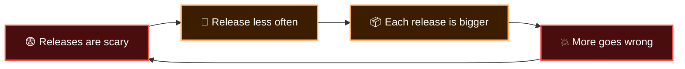
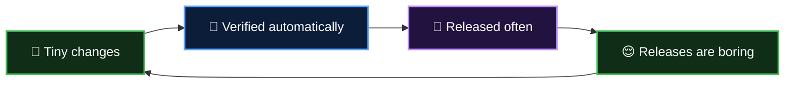

  

  <b>Lesson 1 of 6</b> &nbsp;·&nbsp; ⏱️ 7 min read &nbsp;·&nbsp; 🟢 No experience needed

# 🔄 What is CI/CD?

In Chapter 1 you learned *how* to make GitHub run things. This chapter is about *what's worth running*, and why an entire industry reorganised itself around two short abbreviations.

## 😱 Life before CI/CD

Meet a team of five, building an online shop the old way.

**Weeks 1 to 6.** Everyone works on their own branch. Nobody merges, because merging is painful. Life is peaceful.

**Week 7: "Integration week".** All five branches are merged at once. Asha renamed a function that Ben calls in forty places. Two people edited the same checkout page. The app doesn't even start. This has a name: **integration hell**.

**Week 8: "Release weekend".** Someone follows a 43-step document called `DEPLOY_FINAL_v3_REAL.docx`. Step 27 is out of date. The site is down from Saturday night to Sunday afternoon.

**Week 9.** Everyone agrees releases are dangerous, so they decide to do them *less often*. Which makes each one bigger. Which makes each one more dangerous.

That loop is the trap. CI/CD is the way out.

## 💡 The big idea

> [!IMPORTANT]
> **If it hurts, do it more often, and let a machine do it.**

It sounds backwards, but it works for the same reason washing one plate after dinner beats facing a week of dishes. Small things are easy. Merging ten lines is trivial; merging ten thousand is a project.

So we flip the loop:

**Boring releases are the goal.** A release so routine that nobody stays late for it.

## 🔤 Decoding the letters

| | Letters | Stands for | The question it answers |
|---|---|---|---|
| 🧪 | **CI** | Continuous Integration | *Is this change safe to merge?* |
| 📦 | **CD** | Continuous Delivery | *Could we release this right now?* |
| 🚀 | **CD** | Continuous Deployment | *Why isn't it live already?* |

Yes, **CD means two different things**, and people mix them up constantly. Lesson 3 untangles them. For now:

- **CI** is about *merging and verifying* code
- **CD** is about *getting verified code to users*

  

## 🏭 The assembly line

The mental model is a factory line. Raw material (a commit) goes in one end. It passes a series of stations. Each station either stamps it ✅ and passes it on, or pulls the cord and stops the line. What comes out the far end is a product you'd trust in a customer's hands.

That line is called a **pipeline**, and you'll build one by the end of this chapter.

## 🎁 What you get out of it

| | Benefit | Because |
|---|---|---|
| ⚡ | **Bugs caught in minutes** | Every change is tested the moment it's pushed |
| 🔍 | **Bugs are easy to find** | The culprit is the last small change, not six weeks of work |
| 😌 | **Calm releases** | Deploying is a rehearsed, automated routine |
| 🔁 | **Easy rollbacks** | Small releases are small to undo |
| 🤝 | **Shared confidence** | A green tick means the same thing to everyone |
| 🚀 | **Faster delivery** | Finished work reaches users instead of waiting in a queue |

## 🚫 Three myths

<b>"CI/CD is a tool you install"</b>

 

It's a **practice**. GitHub Actions, Jenkins, GitLab CI and CircleCI are tools that help you do it. You can own every tool and still not practise CI, for example if branches live for a month before merging.

<b>"It's only for big companies"</b>

 

A solo developer benefits on day one. The first time a workflow catches a typo that would have broken your site, it has paid for itself. And it costs nothing on a public repo.

<b>"We need lots of tests before we can start"</b>

 

Start with a pipeline that only checks the code builds. That alone catches a surprising number of mistakes. Add tests one at a time. A small pipeline today beats a perfect one next quarter.

## 🎯 What you learned

- Big, rare merges and releases create a vicious circle of fear
- CI/CD breaks it: **small changes, verified and shipped automatically**
- **CI** verifies; **CD** delivers
- A **pipeline** is the assembly line a change travels down
- CI/CD is a practice first and a toolset second

---

  <a href="../01-introduction-to-github-actions/05-cheat-sheet-and-quiz.md">⬅️ Chapter 1 Quiz</a>
  &nbsp;&nbsp;·&nbsp;&nbsp;
  <a href="index.md">📚 Chapter 2</a>
  &nbsp;&nbsp;·&nbsp;&nbsp;
  <a href="02-continuous-integration.md"><b>Next: Continuous Integration ➡️</b></a>

