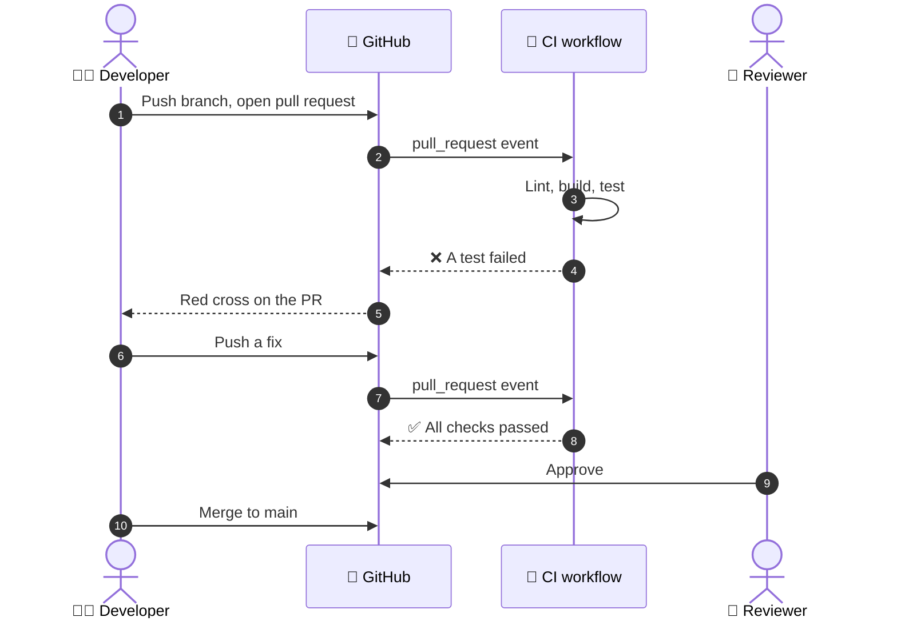
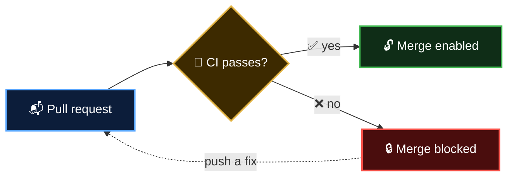

<p align="center">
  <b>Lesson 2 of 6</b> &nbsp;·&nbsp; ⏱️ 8 min read &nbsp;·&nbsp; 🟢 Beginner
</p>

# 🧪 Continuous Integration

## 💡 The definition

> [!IMPORTANT]
> **Continuous Integration is the habit of merging small changes into the shared branch frequently, with every change automatically built and tested.**

Two halves, and both matter:

| | Half | Who does it |
|---|---|---|
| 🧑‍💻 | **Integrate often**: small changes, merged at least daily | People |
| 🤖 | **Verify automatically**: build and test every single change | Machines |

A team with a beautiful test pipeline and month-old branches is not doing CI. They have automated testing. The *continuous* part is the humans' job.

## 🎬 A day in the life of a change



Notice step 4. The failure reached the author within minutes, while the change was still fresh in their head, and before a reviewer spent any time on it. That **fast feedback** is the whole value of CI.

## 🔍 What does a CI run check?

Checks are ordered cheapest first, so obvious mistakes fail fast.

| Order | Check | Catches | Typical time |
|---|---|---|---|
| 1 | 🧹 **Lint / format** | Typos, unused code, style drift | seconds |
| 2 | 🏗️ **Build / compile** | Code that doesn't even assemble | seconds to minutes |
| 3 | 🧪 **Unit tests** | Broken logic in small pieces | seconds to minutes |
| 4 | 🔗 **Integration tests** | Pieces that don't work together | minutes |
| 5 | 🛡️ **Security scans** | Vulnerable dependencies, leaked secrets | minutes |

> [!TIP]
> **Fail fast.** If a 5-second lint check would fail, there's no point waiting 10 minutes for tests to tell you something else is also wrong. Put quick checks first.

## 🚦 The meaning of the tick

On every commit and pull request, GitHub shows the result:

| | Status | Means |
|---|---|---|
| 🟡 | Pending | Checks are running |
| ✅ | Success | Every check passed |
| ❌ | Failure | At least one check failed |

With a **branch protection rule** (or ruleset) you can make the tick mandatory: GitHub disables the **Merge** button until required checks pass. This turns CI from advice into a gate.



## 🧘 The five habits of CI

Tools don't do CI. Teams do. These habits are what make it real:

| | Habit | Why |
|---|---|---|
| 1️⃣ | **Commit small, merge daily** | Small changes rarely conflict and are easy to review |
| 2️⃣ | **Every change triggers the build** | No exceptions means no surprises |
| 3️⃣ | **Keep the build fast** | Aim for under ten minutes; slow feedback gets ignored |
| 4️⃣ | **A red `main` is an emergency** | Fix or revert before doing anything else |
| 5️⃣ | **Test in a clean environment** | Kills "works on my machine" for good |

> [!WARNING]
> **The broken-window effect.** If `main` stays red for a day, people stop looking at the status. Then a second failure hides behind the first. Then nobody trusts the pipeline, and you're back to week 7. Treat red as "stop the line".

## 🧩 How it maps to GitHub Actions

You already know the pieces from Chapter 1. CI is just a particular way of arranging them.

| CI idea | GitHub Actions feature |
|---|---|
| "On every change" | `on: [push, pull_request]` |
| "In a clean environment" | A fresh runner per job |
| "Build and test" | `steps` with `run:` |
| "Fail fast" | `needs:` to order jobs |
| "On every version we support" | `strategy.matrix` |
| "Block bad merges" | Required status checks |

A minimal CI workflow is only this:

```yaml
name: CI

on:
  push:
    branches: [main]
  pull_request:

jobs:
  test:
    runs-on: ubuntu-latest
    steps:
      - uses: actions/checkout@v7
      - uses: actions/setup-python@v7
        with:
          python-version: '3.13'
      - run: python -m unittest discover -v
```

Fourteen lines stand between you and "nobody can merge broken code".

## ✅ Checkpoint

<details>
<summary><b>A team runs a full test suite on every push, but feature branches live for three weeks. Are they doing CI?</b></summary>

<br>

No. They have automated testing, but they aren't *integrating* continuously. After three weeks, merging is still a painful event.

</details>

<details>
<summary><b>Why run lint before the tests?</b></summary>

<br>

Fail fast. Lint takes seconds; if it's going to fail, you want to know before spending minutes on tests.

</details>

<details>
<summary><b>What should happen when <code>main</code> goes red?</b></summary>

<br>

It becomes the team's top priority. Fix it, or revert the change that broke it, before merging anything else.

</details>

---

<p align="center">
  <a href="01-what-is-ci-cd.md">⬅️ What is CI/CD?</a>
  &nbsp;&nbsp;·&nbsp;&nbsp;
  <a href="index.md">📚 Chapter 2</a>
  &nbsp;&nbsp;·&nbsp;&nbsp;
  <a href="03-delivery-vs-deployment.md"><b>Next: Delivery vs Deployment ➡️</b></a>
</p>
