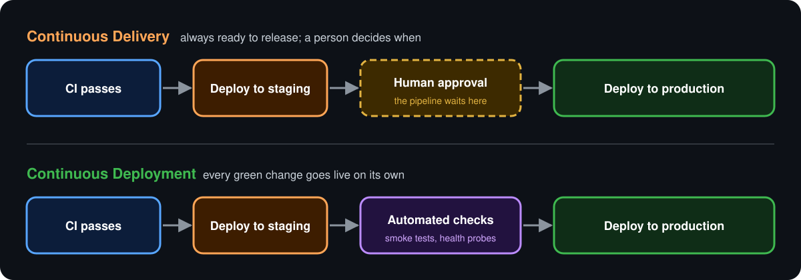
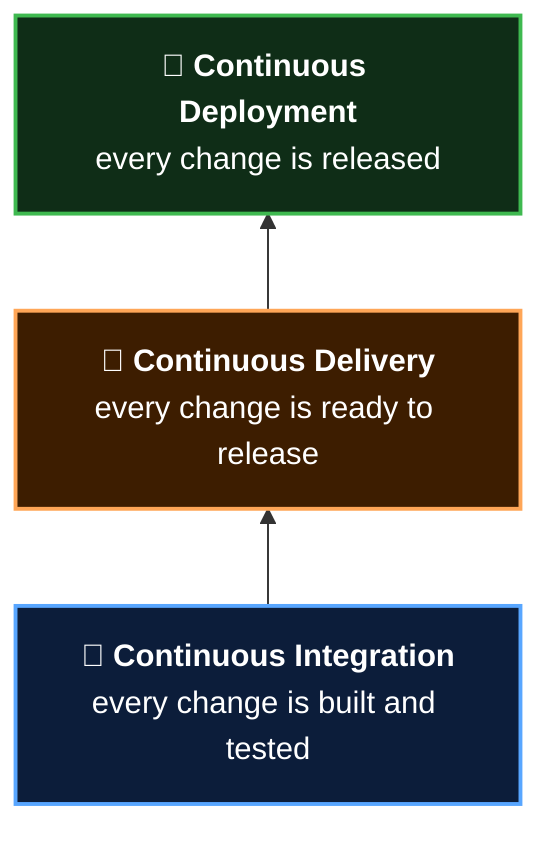
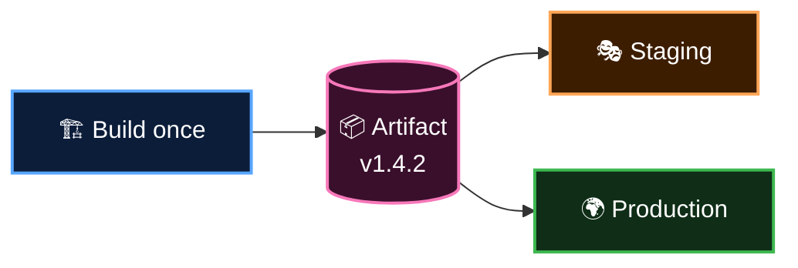
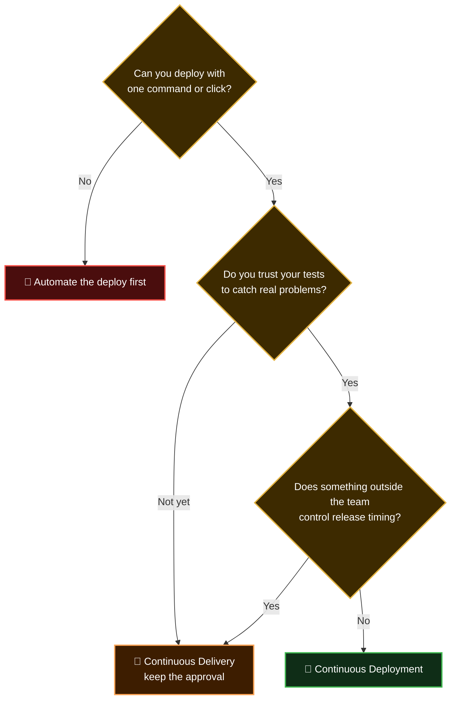

<p align="center">
  <b>Lesson 3 of 6</b> &nbsp;·&nbsp; ⏱️ 7 min read &nbsp;·&nbsp; 🟢 Beginner
</p>

# 🚚 Delivery vs 🚀 Deployment

CI told you a change is *good*. CD is about getting that good change *to users*. And "CD" hides two different promises.

## 🎯 The difference in one picture

<p align="center">
  
</p>

**The only difference is who presses the final button.**

| | 🚚 Continuous Delivery | 🚀 Continuous Deployment |
|---|---|---|
| **Promise** | Every change *could* go live at any moment | Every change *does* go live |
| **Final step to production** | A human clicks **Approve** | Fully automatic |
| **Release frequency** | When the business chooses | Many times a day |
| **What you need** | A reliable, automated deploy | That, plus great tests and monitoring |
| **Fits** | Regulated industries, mobile apps, scheduled launches | Web apps and services with strong test coverage |

> [!TIP]
> **Memory hook:** *Delivery* brings the parcel to your door and waits for a signature. *Deployment* leaves it inside the house.

## 🪜 Three rungs of one ladder

Each practice builds on the one below it. You can't skip a rung.



> [!NOTE]
> Continuous deployment isn't "better" than continuous delivery. It's a choice. Many excellent teams deliberately stop at delivery because a regulator, an app store, or a marketing calendar decides when releases happen.

## 🏗️ Environments: the rehearsal stages

You don't perform a play for the first time on opening night. Code gets rehearsals too, in a series of **environments**.

| | Environment | Audience | Purpose |
|---|---|---|---|
| 💻 | **Development** | You | Try things |
| 🎭 | **Staging** | The team | A production look-alike for a final rehearsal |
| 🌍 | **Production** | Real users | The real thing |

In GitHub Actions, an environment is a named target you attach to a job:

```yaml
jobs:
  deploy:
    runs-on: ubuntu-latest
    environment: production
    steps:
      - run: ./deploy.sh
```

That one line unlocks three things, configured under **Settings → Environments**:

| | Feature | What it does |
|---|---|---|
| ✋ | **Required reviewers** | The job pauses until a named person approves |
| 🔑 | **Environment secrets** | Production credentials only exist for production jobs |
| 🌿 | **Branch restrictions** | Only `main` may deploy here |

> [!IMPORTANT]
> **Required reviewers is the switch between the two CDs.** Turn it on and you have continuous *delivery*. Turn it off and you have continuous *deployment*. The workflow file doesn't change.

## 📦 Build once, deploy many

One rule separates trustworthy pipelines from hopeful ones:

> [!IMPORTANT]
> **Build the artifact once. Deploy that exact same artifact to every environment.**

An **artifact** is the packaged output of your build: a zip, a container image, a compiled binary.



If you rebuild for production, you are shipping something that was **never tested**. A dependency may have released a new version in between. Staging proved nothing.

Differences between environments (database URLs, API keys) belong in **configuration**, supplied at deploy time, never baked into the build.

## 🛟 Deploying without fear

A few release strategies you'll hear named. You don't need them yet, but you should recognise the words.

| | Strategy | Idea in one line |
|---|---|---|
| 🔄 | **Rolling** | Replace servers a few at a time |
| 🔵🟢 | **Blue-green** | Run old and new side by side, then flip the traffic switch |
| 🐤 | **Canary** | Send 1% of users to the new version and watch before widening |
| 🚩 | **Feature flags** | Ship the code switched off; turn it on later without a deploy |

All of them answer the same question: *how do we find out it's broken while it only affects a few people, and undo it quickly?*

## 🧭 Which one should you choose?



## ✅ Checkpoint

<details>
<summary><b>A team's pipeline deploys to staging automatically, then waits for a manager to approve production. Which CD is that?</b></summary>

<br>

Continuous **delivery**. A human makes the final call.

</details>

<details>
<summary><b>Why is rebuilding the app separately for production a bad idea?</b></summary>

<br>

The production build is then a different artifact from the one you tested. Anything that changed between builds (a dependency, a base image, a compiler) ships untested.

</details>

<details>
<summary><b>Which GitHub Actions setting turns continuous deployment into continuous delivery?</b></summary>

<br>

**Required reviewers** on the environment the deploy job targets.

</details>

---

<p align="center">
  <a href="02-continuous-integration.md">⬅️ Continuous Integration</a>
  &nbsp;&nbsp;·&nbsp;&nbsp;
  <a href="index.md">📚 Chapter 2</a>
  &nbsp;&nbsp;·&nbsp;&nbsp;
  <a href="04-anatomy-of-a-pipeline.md"><b>Next: Anatomy of a Pipeline ➡️</b></a>
</p>
