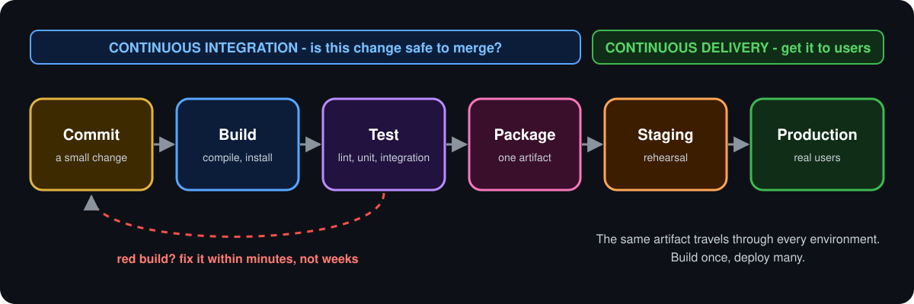
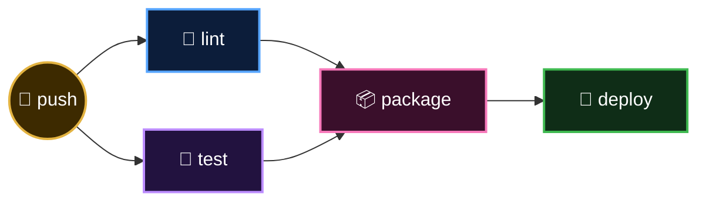

<p align="center">
  <b>Lesson 4 of 6</b> &nbsp;·&nbsp; ⏱️ 9 min read &nbsp;·&nbsp; 🟡 Builds on Chapter 1
</p>

# 🏭 Anatomy of a Pipeline

A **pipeline** is the automated path a change takes from "pushed" to "running in production". Tools differ, languages differ, but the stages are remarkably consistent.

<p align="center">
  
</p>

## 🚉 The five stations

| | Stage | Question | Output |
|---|---|---|---|
| 1️⃣ | 📥 **Source** | What changed? | A commit |
| 2️⃣ | 🏗️ **Build** | Does it assemble? | Compiled code, installed dependencies |
| 3️⃣ | 🧪 **Test** | Does it behave? | A pass or fail verdict |
| 4️⃣ | 📦 **Package** | What exactly are we shipping? | One versioned artifact |
| 5️⃣ | 🚀 **Deploy** | Is it in front of users? | A running release |

Each stage is a **quality gate**. A change only moves right if the gate opens. A failure anywhere stops the line.

## 🧩 Pipelines in GitHub Actions

GitHub Actions has no keyword called `pipeline` or `stage`. You build them from pieces you already know:

> [!IMPORTANT]
> **A stage is a job. The pipeline's order comes from `needs`.**

```yaml
jobs:
  lint:
    runs-on: ubuntu-latest
    steps: [...]

  test:
    needs: lint            # 👈 stage 2 waits for stage 1
    runs-on: ubuntu-latest
    steps: [...]

  package:
    needs: test            # 👈 stage 3 waits for stage 2
    runs-on: ubuntu-latest
    steps: [...]
```

GitHub draws that as a graph on the run page:


If `lint` fails, `test` and `package` are **skipped** automatically. That's the quality gate, for free.

## 🔀 Fan-out and fan-in

`needs` takes a list, so stages can run side by side and then join up.

```yaml
  package:
    needs: [lint, test]
```



| Shape | Good for | Trade-off |
|---|---|---|
| **Serial** (`lint → test`) | Failing fast, saving minutes | Slower when everything passes |
| **Parallel** (`lint` + `test`) | Fastest total time | Runs tests even when lint would fail |

Neither is right in general. Fast checks first in serial, slow checks in parallel, is a sensible default.

📎 Full example: [assets/snippets/job-dependencies.yml](../assets/snippets/job-dependencies.yml)

## 🧮 The matrix: one job, many variations

"Does it work on Python 3.12, 3.13 *and* 3.14?" Don't copy the job three times. Describe the variations and let GitHub multiply.

```yaml
  test:
    runs-on: ubuntu-latest
    strategy:
      matrix:
        python-version: ['3.12', '3.13', '3.14']
    steps:
      - uses: actions/checkout@v7
      - uses: actions/setup-python@v7
        with:
          python-version: ${{ matrix.python-version }}
      - run: python -m unittest discover -v
```

One job definition becomes three parallel jobs, each with a different value in `${{ matrix.python-version }}`.

> [!TIP]
> Add a second key, such as `os: [ubuntu-latest, windows-latest]`, and you get every combination: 3 versions × 2 systems = 6 jobs.

## 🎒 Carrying things between stages

Remember the rule from Chapter 1: **every job gets a fresh, empty runner**. So how does the thing you built in `package` reach `deploy`?

| | Mechanism | Carries | Lives for |
|---|---|---|---|
| 📦 | **Artifacts** | Files (builds, reports, logs) | Days; downloadable from the run page |
| 🏷️ | **Job outputs** | Small strings (a version, a URL) | The workflow run |
| ⚡ | **Cache** | Dependencies you'd otherwise re-download | Across runs, until evicted |

```yaml
  package:
    steps:
      - run: tar -czf app.tar.gz src/
      - uses: actions/upload-artifact@v7
        with:
          name: app
          path: app.tar.gz

  deploy:
    needs: package
    steps:
      - uses: actions/download-artifact@v8
        with:
          name: app
      - run: ./deploy.sh app.tar.gz
```

This is **build once, deploy many** in practice: `deploy` receives the exact bytes `package` produced.

> [!WARNING]
> **Artifact or cache?** They look similar and are often confused.
> - An **artifact** is an *output* of your pipeline. You want to keep it or pass it on.
> - A **cache** is a *speed-up*. If it disappeared, the pipeline would still work, just slower.

## ⏱️ What makes a pipeline good?

| | Quality | Rule of thumb |
|---|---|---|
| ⚡ | **Fast** | Feedback in under ten minutes |
| 🎯 | **Reliable** | Fails only when the code is wrong; flaky tests get fixed or removed |
| 🔁 | **Repeatable** | Same commit, same result, every time |
| 👀 | **Visible** | Anyone can see what ran and why it failed |
| 🔒 | **Secure** | Minimal permissions; secrets never printed |

## ✅ Checkpoint

<details>
<summary><b>How do you express "stage B runs after stage A" in GitHub Actions?</b></summary>

<br>

Make each stage a job and give B `needs: A`.

</details>

<details>
<summary><b>A matrix has <code>python-version: ['3.12', '3.13']</code> and <code>os: [ubuntu-latest, windows-latest, macos-latest]</code>. How many jobs run?</b></summary>

<br>

Six: 2 versions × 3 operating systems.

</details>

<details>
<summary><b>You want to stop re-downloading 400 MB of dependencies on every run. Artifact or cache?</b></summary>

<br>

Cache. It's a speed-up, not an output you need to keep.

</details>

---

<p align="center">
  <a href="03-delivery-vs-deployment.md">⬅️ Delivery vs Deployment</a>
  &nbsp;&nbsp;·&nbsp;&nbsp;
  <a href="index.md">📚 Chapter 2</a>
  &nbsp;&nbsp;·&nbsp;&nbsp;
  <a href="05-your-first-ci-pipeline.md"><b>Next: Your First CI Pipeline ➡️</b></a>
</p>
