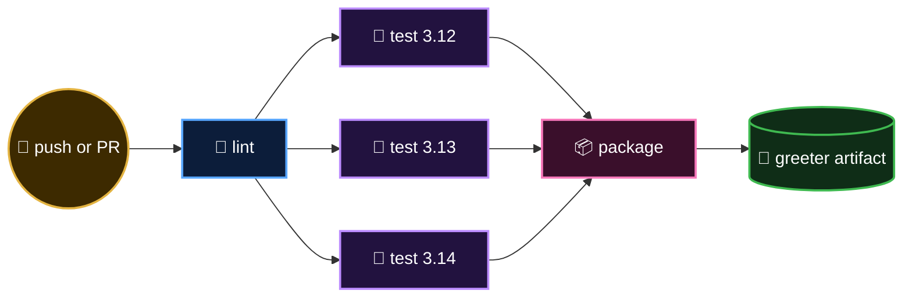

<p align="center">
  <b>Lesson 5 of 6</b> &nbsp;·&nbsp; ⏱️ 25 min hands-on &nbsp;·&nbsp; 🛠️ Keyboard required
</p>

# 🛠️ Your First CI Pipeline

Time to turn theory into green ticks. You'll run a real pipeline, watch it catch a bug you plant, and download what it builds.

## 🧰 The cast

| | File | Role |
|---|---|---|
| 🐍 | [`sample-app/greeter/core.py`](../sample-app/greeter/core.py) | The app: two tiny functions |
| 🧪 | [`sample-app/tests/test_core.py`](../sample-app/tests/test_core.py) | Five unit tests |
| 📋 | [`sample-app/requirements-dev.txt`](../sample-app/requirements-dev.txt) | Dev tools (the Ruff linter) |
| ⚙️ | [`.github/workflows/02-ci-basics.yml`](../.github/workflows/02-ci-basics.yml) | The pipeline |

The app is deliberately boring, so the pipeline can be the star:

```python
def greet(name: str = "World") -> str:
    """Return a friendly greeting, falling back to World for blank names."""
    cleaned = name.strip()
    return f"Hello, {cleaned or 'World'}!"
```

> [!NOTE]
> You don't need to know Python. Every idea here transfers directly to Node.js, Java, Go or anything else. Only the commands inside `run:` change.

## 🗺️ The pipeline you're about to run



Three stages, five jobs, one artifact.

## 📄 The workflow, piece by piece

### 🔔 Part 1: When it runs

```yaml
name: 02 - CI Basics

on:
  push:
    branches: [main]
    paths:
      - sample-app/**
      - .github/workflows/02-ci-basics.yml
  pull_request:
    paths:
      - sample-app/**
      - .github/workflows/02-ci-basics.yml
  workflow_dispatch:
```

| Trigger | Why |
|---|---|
| `pull_request` | Verify a change **before** it merges |
| `push` to `main` | Verify the result **after** it merges |
| `paths` | Skip the pipeline when only docs changed |
| `workflow_dispatch` | A manual button, for experimenting |

### 🛡️ Part 2: Ground rules

```yaml
permissions:
  contents: read

concurrency:
  group: ci-${{ github.ref }}
  cancel-in-progress: true

defaults:
  run:
    working-directory: sample-app
```

| Key | Effect |
|---|---|
| `permissions` | The run can read the repo and nothing more |
| `concurrency` | Push twice quickly and the older run on that branch is cancelled. No wasted minutes |
| `defaults.run.working-directory` | Every `run:` step starts inside `sample-app/` |

### 🧹 Part 3: Stage one, lint

```yaml
jobs:
  lint:
    runs-on: ubuntu-latest
    steps:
      - uses: actions/checkout@v7

      - uses: actions/setup-python@v7
        with:
          python-version: '3.13'
          cache: pip
          cache-dependency-path: sample-app/requirements-dev.txt

      - name: Install dev tools
        run: python -m pip install -r requirements-dev.txt

      - name: Lint
        run: ruff check .
```

The cheapest check goes first. `cache: pip` saves downloaded packages between runs, keyed on the requirements file.

### 🧪 Part 4: Stage two, test on three Pythons

```yaml
  test:
    needs: lint
    runs-on: ubuntu-latest
    strategy:
      matrix:
        python-version: ['3.12', '3.13', '3.14']
    steps:
      - uses: actions/checkout@v7

      - uses: actions/setup-python@v7
        with:
          python-version: ${{ matrix.python-version }}

      - name: Run unit tests
        run: python -m unittest discover -v
```

`needs: lint` is the gate. The `matrix` multiplies this one job into three.

### 📦 Part 5: Stage three, package

```yaml
  package:
    needs: test
    runs-on: ubuntu-latest
    steps:
      - uses: actions/checkout@v7

      - name: Build the artifact
        run: |
          mkdir -p dist
          tar -czf "dist/greeter-${GITHUB_SHA::7}.tar.gz" greeter
          ls -lh dist

      - name: Upload the artifact
        uses: actions/upload-artifact@v7
        with:
          name: greeter
          path: sample-app/dist/
          retention-days: 7
```

The archive is named after the commit (`greeter-8f3a1c2.tar.gz`), so you always know exactly which code is inside.

> [!WARNING]
> **A subtle one.** `working-directory` applies to `run:` steps only. Inputs to actions, like `path:` here, are relative to the repository root. That's why it says `sample-app/dist/` and not `dist/`.

## ▶️ Exercise 1: Go green

1. In your fork, open **Actions → 02 - CI Basics**
2. Click **Run workflow**, then the green button
3. Click into the run and watch the graph fill in from left to right

When it finishes you'll see five ✅ jobs. Expand **test (3.13) → Run unit tests**:

```text
test_blank_name_falls_back_to_world ... ok
test_defaults_to_world ... ok
test_greets_by_name ... ok
test_trims_whitespace ... ok
test_shouts ... ok

Ran 5 tests in 0.001s

OK
```

## 🎁 Exercise 2: Collect your artifact

Scroll to the bottom of the run's **Summary** page. Under **Artifacts**, click **greeter** to download it. Inside is a `.tar.gz` named after your commit.

You just produced a traceable, versioned build without touching your own machine. In a real pipeline, that is the file a deploy job would ship.

## 🐛 Exercise 3: Plant a bug, watch CI catch it

This is the moment CI earns its keep.

**1. Create a branch**

```bash
git switch -c break-the-greeting
```

**2. Break the app.** In `sample-app/greeter/core.py`, change the greeting:

```diff
-    return f"Hello, {cleaned or 'World'}!"
+    return f"Howdy, {cleaned or 'World'}!"
```

**3. Push and open a pull request** (against `main` *of your own fork*)

```bash
git commit -am "Make the greeting friendlier"
git push -u origin break-the-greeting
```

**4. Watch the pull request page.** Within a minute:

```text
❌ 02 - CI Basics / test (3.12)   Failing
❌ 02 - CI Basics / test (3.13)   Failing
❌ 02 - CI Basics / test (3.14)   Failing
⏭️ 02 - CI Basics / package       Skipped
```

Open a failing job and the log tells you precisely what's wrong:

```text
FAIL: test_greets_by_name (tests.test_core.GreetTests.test_greets_by_name)
AssertionError: 'Howdy, Octocat!' != 'Hello, Octocat!'
```

Look at what just happened:

- ✅ `lint` passed (the code is *valid*, just *wrong*)
- ❌ `test` caught the behaviour change, on all three versions
- ⏭️ `package` never ran, so **no broken artifact exists**

Nobody had to remember to run the tests. Nobody reviewed broken code. The bug never reached `main`.

**5. Fix it.** Change `Howdy` back to `Hello`, commit and push. The same pull request turns green.

> [!TIP]
> Notice you didn't open a new pull request. Each push to the branch re-runs CI, and `concurrency` cancels any run that's now out of date.

## 🧹 Exercise 4: Fail the lint gate

Add an unused import to the top of `core.py` and push:

```python
import os
```

This time `lint` fails with rule **F401** (`os` imported but unused), and **`test` and `package` are both skipped**. The pipeline stopped at the first, cheapest gate, in seconds. That's *fail fast*. Remove the line to recover.

## 🔒 Bonus: Make the tick mandatory

Right now a red pull request can still be merged. To close that door:

1. **Settings → Rules → Rulesets → New branch ruleset**
2. Target the default branch
3. Enable **Require status checks to pass** and add the checks: `lint`, each `test (3.x)` variant, and `package`
4. Save

The **Merge** button is now disabled until CI is green. Your pipeline has become a gate.

## 🧯 Something went wrong?

| Symptom | Likely cause |
|---|---|
| Pipeline didn't start on push | Your change wasn't under `sample-app/`, so `paths` filtered it out |
| PR shows no checks | The PR targets the original repo, not your fork |
| `No file matched to requirements-dev.txt` | `cache-dependency-path` is relative to the repo root |
| `ModuleNotFoundError: greeter` | A `run:` step isn't in `sample-app/`; check `working-directory` |
| Artifact upload finds no files | `path:` must be relative to the repo root |

## 🎯 What you learned

- How to stage a pipeline with `needs`
- How a `matrix` multiplies one job across versions
- How artifacts carry a build out of a runner
- How `paths`, `concurrency` and `permissions` keep a pipeline lean and safe
- What it feels like when CI catches a bug before a human does

---

<p align="center">
  <a href="04-anatomy-of-a-pipeline.md">⬅️ Anatomy of a Pipeline</a>
  &nbsp;&nbsp;·&nbsp;&nbsp;
  <a href="index.md">📚 Chapter 2</a>
  &nbsp;&nbsp;·&nbsp;&nbsp;
  <a href="06-cheat-sheet-and-quiz.md"><b>Next: Cheat Sheet & Quiz ➡️</b></a>
</p>
