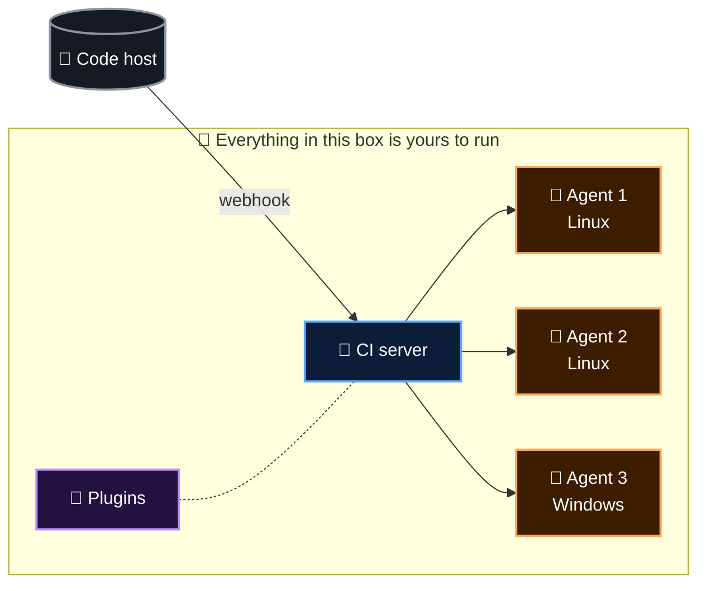
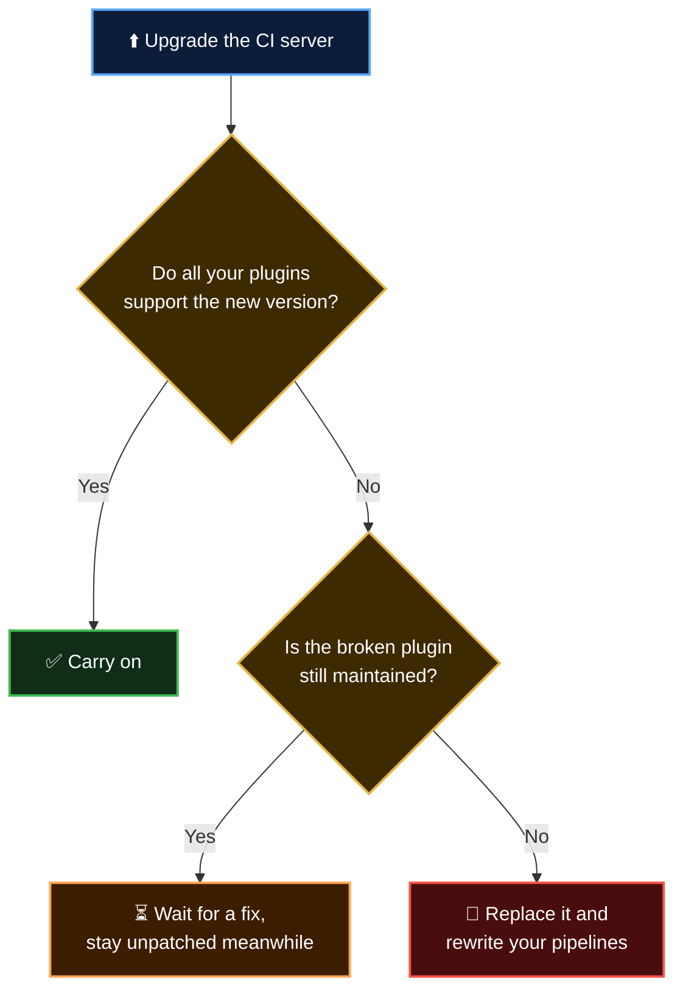

  <b>Lesson 2 of 4</b> &nbsp;·&nbsp; ⏱️ 8 min read &nbsp;·&nbsp; 🟢 Beginner

# 🧊 The Hidden Costs of Running Your Own CI Server

The meeting in [Lesson 1](01-the-problem-statement.md) produced six complaints. Each one is a symptom. This lesson looks at the cause behind each, so that you can recognise them in any tool, not just one.

## 🏗️ How a traditional setup is built

The **CI server** decides what should run. The **agents** do the running. **Plugins** extend the server. Your code lives somewhere else and pokes the server with a **webhook** when something changes.

Now the six pains, one box at a time.

## 1️⃣ You own a server

The CI server is an application like any other. It needs everything a production application needs:

| | Chore | What happens if you skip it |
|---|---|---|
| 🩹 | Operating system patches | Known vulnerabilities on a machine that holds your deploy keys |
| ⬆️ | CI server upgrades | You fall behind on security fixes |
| 💾 | Backups | One dead disk erases every pipeline and its history |
| 📈 | Monitoring disk, memory, CPU | Saturday's full disk, discovered on Monday |
| 🔐 | User accounts, TLS certificates | An expired certificate stops all builds at once |

> [!WARNING]
> A CI server is one of the most valuable targets in a company. It can read your source code and it holds the credentials that deploy to production. "We'll patch it later" is a risky sentence.

## 2️⃣ Agents turn into snowflakes

A build agent is usually a long-lived machine. Somebody installed Java on it in March, Node in June, and a newer Node in September "just for one project".

Two problems follow.

**Tool drift.** Agent 1 has Python 3.11. Agent 2 has 3.13. Your build passes or fails depending on which agent picks it up.

**Leftovers.** When a build finishes, the machine is not wiped. Old files, cached packages, a stray background process and a half-written config file are all still there for the next build to trip over.

| | Long-lived agent | What you actually want |
|---|---|---|
| Starting state | Whatever the last build left behind | Identical every time |
| Installed tools | Whatever someone added by hand | Declared in the pipeline |
| "Works on agent 2" | A real sentence people say | Impossible |

Each agent slowly becomes unique, a **snowflake**. Nobody can rebuild it from memory.

## 3️⃣ Capacity is always the wrong size

You have to decide how many agents to run **in advance**. Developers don't push code at an even pace.

| Time | Builds wanted | With 2 agents |
|---|:---:|---|
| 🌅 09:00 | 1 | 😴 One agent idle |
| ☀️ 11:00 | 3 | ⏳ One build waits |
| 🔥 16:30, before a release | 9 | ⏳⏳⏳ Seven builds wait |
| 🌙 02:00 | 0 | 💸 Two agents idle, still on the bill |

Too few agents and people wait. Too many and you pay for machines that sit idle. Scaling automatically is possible, but that is another system for you to build and maintain.

> [!NOTE]
> Slow feedback has a real cost. In [Chapter 2](../02-basics-of-ci-cd/02-continuous-integration.md) you learned that CI works because feedback arrives in minutes. A 50-minute queue quietly undoes that.

## 4️⃣ Plugins: the superpower and the weak point

Traditional CI servers do very little on their own. Talking to Git is a plugin. Storing credentials is a plugin. Sending a Slack message is a plugin. Jenkins has well over a thousand of them, written by many different volunteers and vendors.

That openness is why these tools can do almost anything. It is also where a lot of the fragility comes from.

| | Plugin problem | Why it bites |
|---|---|---|
| 🕸️ | **Dependency chains** | Plugins depend on other plugins. Updating one can force updates to five |
| 🌍 | **Server-wide scope** | A plugin is installed once for everyone. One team's upgrade can break another team's pipeline |
| 🛡️ | **Security advisories** | Plugins run inside the server, so a flaw in one is a flaw in the server |
| 🪦 | **Abandonment** | Volunteer maintainers move on. The plugin stays in your pipeline |

## 5️⃣ Glue between the tool and your code

Your code is in one system and your CI server is in another. Connecting them is your job:

- A **webhook** so the code host can tell the server about pushes
- A **network path** so that webhook can reach a server inside your firewall
- An **access token** so the server can clone the repository
- Another integration so the result shows up as a ✅ or ❌ on the pull request
- A second set of **user accounts and permissions** to keep in step with the first

None of it is hard. All of it breaks silently when a token expires or an address changes, and developers find out when their pull request shows no status at all.

## 6️⃣ The knowledge lives in one head

Over time the setup becomes a collection of decisions made through an admin screen: which plugins, which versions, which agents carry which label, which credentials go where.

| | Question | Answer on many teams |
|---|---|---|
| ❓ | Why does agent 3 have that environment variable? | "Ask Ben" |
| ❓ | Who changed the deploy job last week? | "Not sure, it isn't in Git" |
| ❓ | Could we rebuild this server from scratch? | "Please don't make us find out" |

> [!NOTE]
> Modern traditional tools can keep a lot in version control. Jenkins, for example, lets you write the pipeline as a `Jenkinsfile` in your repository. That helps with the pipeline itself. The server, its plugins, its agents and its credentials still live outside the repo.

## 🧊 The iceberg

Most of these tools are free to download. That is the part above the water.

| 🌊 Above the waterline | 🧊 Below the waterline |
|---|---|
| Licence: free | Machines running around the clock |
| | Hours spent patching and upgrading |
| | Builds lost to outages |
| | Developers waiting in queues |
| | A specialist, or a developer acting as one |
| | The risk of an unpatched server holding production keys |

> [!IMPORTANT]
> **A free licence is not a free tool.** The real price of a self-hosted CI server is paid in engineering time.

## ⚖️ To be fair

Plenty of organisations run traditional CI tools extremely well. They usually have something the team of five does not: **a dedicated platform team** whose whole job is the build system. With that investment you get total control over hardware, network and configuration.

The problem statement is not "these tools don't work". It is that **for a team whose job is something else, the upkeep is a tax on every sprint**.

## ✅ Checkpoint

<b>What is a "snowflake" agent, and why is it a problem?</b>

 

A long-lived build machine that has been changed by hand so many times that it is unique. Builds behave differently depending on which agent runs them, and nobody can recreate the machine reliably.

<b>Why can a plugin stop you from installing a security update?</b>

 

Plugins are tied to server versions and to each other. If a plugin you depend on doesn't work with the new server version, you must either wait, replace the plugin, or stay on the vulnerable version.

<b>Your team has two agents. Name the two opposite ways that number can be wrong on the same day.</b>

 

Too few at peak time, so builds queue. Too many overnight, so you pay for idle machines.

<b>"It's open source, so it costs nothing." What's missing from that sentence?</b>

 

Everything below the waterline: the machines, the maintenance hours, the outages, the queues and the people needed to run it.

## 🎯 What you learned

- A self-hosted CI server is a **production system** you must patch, back up and monitor
- Long-lived agents drift into **snowflakes** and carry leftovers between builds
- Fixed capacity is **too small at peak and too large at night**
- Plugins give flexibility and take away **safe, easy upgrades**
- Connecting the server to your code host is **glue you maintain**
- Setup knowledge tends to live **outside version control**, in one person's head

---

  <a href="01-the-problem-statement.md">⬅️ The Problem Statement</a>
  &nbsp;&nbsp;·&nbsp;&nbsp;
  <a href="index.md">📚 Chapter 3</a>
  &nbsp;&nbsp;·&nbsp;&nbsp;
  <a href="03-how-github-actions-answers.md"><b>Next: How GitHub Actions Answers ➡️</b></a>

