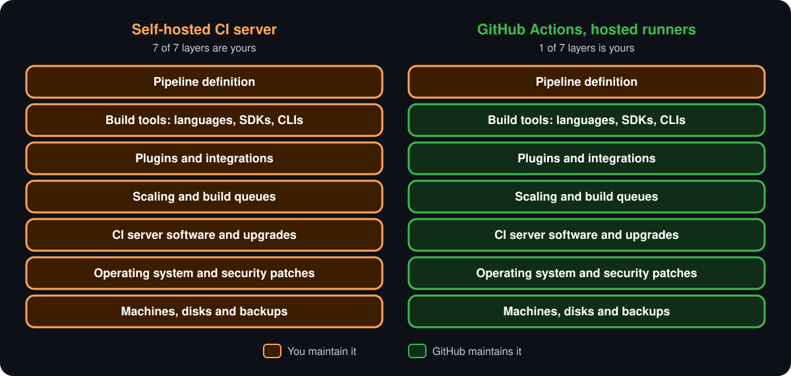
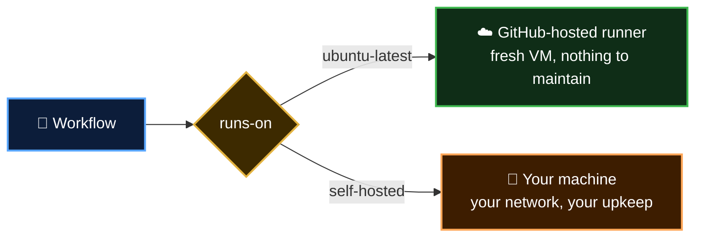
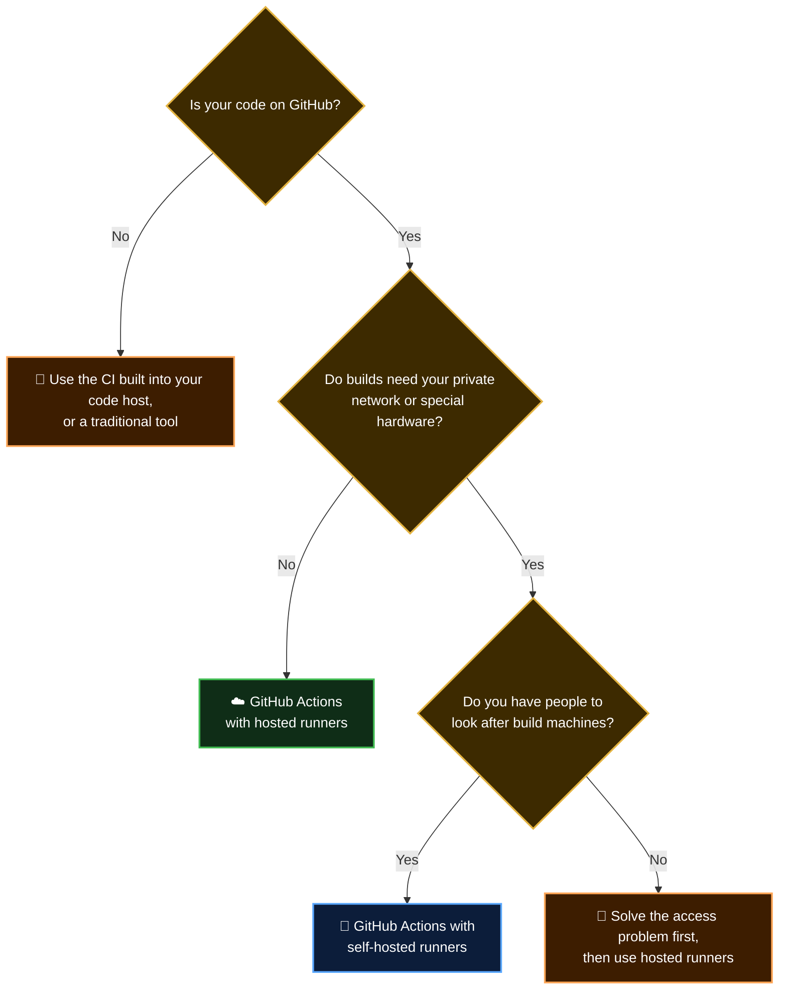

<p align="center">
  <b>Lesson 3 of 4</b> &nbsp;·&nbsp; ⏱️ 9 min read &nbsp;·&nbsp; 🟢 Beginner
</p>

# 🛟 How GitHub Actions Answers the Problem

[Lesson 2](02-hidden-costs-of-self-hosted-ci.md) listed six pains. They share one root: **you were running a tool**. GitHub Actions changes the deal. You stop running a tool and start using a service.

## 🎯 The shift in one picture

<p align="center">
  
</p>

On the left, every layer is yours. On the right, you keep the one layer that is actually about your product: **the pipeline definition**. That is the workflow file you learned to read in [Chapter 1](../01-introduction-to-github-actions/03-anatomy-of-a-workflow.md).

## ✅ Checking the wish list

Here is the team's list from [Lesson 1](01-the-problem-statement.md), held up against GitHub Actions.

| | They wanted | GitHub Actions gives you | Meet it in |
|---|---|---|---|
| ⏳ | Capacity on demand | Each job gets its own **GitHub-hosted runner**. Nine jobs means nine machines | [1.2](../01-introduction-to-github-actions/02-core-concepts.md) |
| 🤷 | A clean, predictable machine | A **fresh virtual machine per job**, thrown away afterwards. Tool versions are declared in the workflow | [2.5](../02-basics-of-ci-cd/05-your-first-ci-pipeline.md) |
| 💾 | Nothing to install, patch or monitor | No server. GitHub runs the service and maintains the runner images | [1.1](../01-introduction-to-github-actions/01-what-is-github-actions.md) |
| 🧩 | Integrations that don't hold the system hostage | **Actions** are chosen per workflow and per version, not installed server-wide | [1.3](../01-introduction-to-github-actions/03-anatomy-of-a-workflow.md) |
| 🏝️ | Configuration in the repository | Workflows are **YAML files in `.github/workflows/`**, reviewed in pull requests | [1.3](../01-introduction-to-github-actions/03-anatomy-of-a-workflow.md) |
| 💸 | Pay for what you use | Billed **per minute** of job time. Free on public repositories with standard runners | [1.1](../01-introduction-to-github-actions/01-what-is-github-actions.md#-what-does-it-cost) |

And the glue from pain 5 simply disappears. Your code and your CI live in the same place, so there is no webhook to configure, no clone token to rotate and no separate set of user accounts. Results show up on the pull request without any setup.

## 🧩 Plugins vs actions

This one deserves a closer look, because actions and plugins sound like the same idea.

| | 🧩 Server plugin | ⚡ Action |
|---|---|---|
| **Installed** | Once, into the server, by an admin | Never. You reference it in a step |
| **Scope** | Every pipeline on the server | Only the workflow that names it |
| **Version** | One version for everybody | Each workflow picks its own |
| **Upgrading** | Can break other teams' pipelines | Affects only the file you edit |
| **Runs** | Inside the CI server | On the throwaway runner |

```yaml
steps:
  - uses: actions/checkout@v7        # this workflow's choice
  - uses: actions/setup-python@v7    # change it here, nothing else moves
```

The upgrade trap from Lesson 2 can't happen. There is no server to upgrade, and bumping an action in one workflow leaves every other workflow untouched.

## 🔍 Same pipeline, two worlds

Here is a lint-and-test pipeline for the [sample app](../sample-app/) written for Jenkins:

```groovy
pipeline {
    agent { label 'linux-python' }
    stages {
        stage('Lint') {
            steps {
                sh 'python -m pip install -r requirements-dev.txt'
                sh 'ruff check .'
            }
        }
        stage('Test') {
            steps {
                sh 'python -m unittest discover -v'
            }
        }
    }
}
```

And the same thing as a GitHub Actions workflow:

```yaml
name: CI
on: [push, pull_request]

jobs:
  lint-and-test:
    runs-on: ubuntu-latest
    steps:
      - uses: actions/checkout@v7
      - uses: actions/setup-python@v7
        with:
          python-version: '3.13'
      - run: python -m pip install -r requirements-dev.txt
      - run: ruff check .
      - run: python -m unittest discover -v
```

The two files are about the same length, and that is the point. **The difference isn't in the file. It's in what has to exist before the file can run.**

| | Before the Jenkinsfile runs | Before the workflow runs |
|---|---|---|
| 🧠 | A CI server, installed and reachable | Nothing |
| 💪 | An agent labelled `linux-python`, with the right Python on it | Nothing: `runs-on` requests a machine, `setup-python` picks the version |
| 🧩 | Pipeline and Git plugins, at compatible versions | Nothing |
| 🔗 | A webhook and a clone credential | Nothing |
| 📄 | The file, committed | The file, committed |

Notice the line `agent { label 'linux-python' }`. It doesn't describe a machine. It **points at one that somebody built by hand**. The workflow's `python-version: '3.13'` describes what it needs, and gets it on a clean machine every time.

## 🧾 What is still your job

GitHub Actions doesn't remove responsibility. It moves the line.

| | Still yours | Why |
|---|---|---|
| 📜 | Writing and maintaining workflows | That's the pipeline definition: the layer you kept |
| ⬆️ | Keeping action versions current | Old versions stop getting fixes |
| 🔑 | Managing secrets | Deploy credentials are as sensitive as ever |
| 🛡️ | Vetting third-party actions | An action is someone else's code running with access to your repository |
| 💰 | Watching minutes on private repositories | Pay-per-use means a wasteful pipeline costs money |

> [!WARNING]
> Actions from the Marketplace are written by many different authors, just like plugins. Prefer well-maintained ones, read what they do, and for anything sensitive pin the action to a full commit SHA so the code can't change underneath you.

## ⚖️ The honest trade-offs

A fair comparison has two columns. Here is what you give up.

| | Trade-off | What it means |
|---|---|---|
| 🔒 | **Tied to GitHub** | Workflow syntax is specific to GitHub. Moving to another platform means rewriting pipelines |
| 🌐 | **Hosted runners live on the public internet** | They can't reach a database or server inside your private network without extra setup |
| 🔧 | **Less control over the machine** | You pick from the runner sizes and images GitHub offers |
| ⏱️ | **Job time limit** | A job on a GitHub-hosted runner is stopped after 6 hours |
| 💰 | **Cost at very high volume** | Per-minute pricing can exceed the cost of your own machines if you build constantly |
| 🚨 | **Someone else's outage** | If the service has an incident, you wait. You can't log in and fix it |

## 🌉 The middle path: self-hosted runners

GitHub Actions also lets you bring your own machines, called **self-hosted runners**. GitHub still does the scheduling, the UI and the logs. Your machine does the running.



They solve the private-network and special-hardware problems. They also bring back pains 1 to 3 from Lesson 2 for those machines: you patch them, you keep them clean and you decide how many to run.

> [!TIP]
> Start with GitHub-hosted runners. Reach for self-hosted ones only when you hit a specific wall, such as needing a GPU or access to an internal system.

## 🧭 So which should you use?



A traditional tool is still a sound choice when you have a platform team, strict rules about where builds may run, or years of working pipelines that nobody needs to change.

## 🚚 Already on a traditional tool?

You don't have to move everything at once. Most teams start new projects on GitHub Actions and migrate old pipelines one at a time. GitHub publishes a [migration guide for Jenkins](https://docs.github.com/en/actions/tutorials/migrate-to-github-actions/manual-migrations/migrate-from-jenkins) that maps each concept across:

| Jenkins | GitHub Actions |
|---|---|
| `Jenkinsfile` | Workflow file in `.github/workflows/` |
| `agent` | `runs-on` |
| `stage` | Job |
| `steps` | `steps` |
| Plugin | Action |
| Credentials | Secrets |

## ✅ Checkpoint

<details>
<summary><b>The Jenkinsfile and the workflow were about the same length. So where is the saving?</b></summary>

<br>

In everything that must exist before the file runs. The Jenkinsfile needs a server, a prepared agent, plugins, a webhook and a credential. The workflow needs only to be committed.

</details>

<details>
<summary><b>Why can't upgrading an action break another team's pipeline the way upgrading a plugin can?</b></summary>

<br>

A plugin is installed once for the whole server. An action is referenced, with its version, inside a single workflow file. Changing it there changes nothing anywhere else.

</details>

<details>
<summary><b>Name two things that are still your responsibility on GitHub Actions.</b></summary>

<br>

Any two of: writing and maintaining workflows, keeping action versions current, managing secrets, vetting third-party actions, and watching minute usage on private repositories.

</details>

<details>
<summary><b>Your tests must talk to a database inside the company network. What are you likely to need?</b></summary>

<br>

A self-hosted runner inside that network, or another way of giving hosted runners access. Standard GitHub-hosted runners can't reach private systems on their own.

</details>

## 🎯 What you learned

- GitHub Actions swaps **running a tool** for **using a service**: you keep only the pipeline definition
- Hosted runners answer the queue, snowflake and upkeep problems with a **fresh machine per job**
- **Actions** are versioned per workflow, so upgrades are local and safe
- You still own workflows, secrets, action hygiene and cost
- The trade-offs are real: **GitHub lock-in, no private-network access by default, less machine control**
- **Self-hosted runners** are the middle path, and they bring some upkeep back

---

<p align="center">
  <a href="02-hidden-costs-of-self-hosted-ci.md">⬅️ The Hidden Costs</a>
  &nbsp;&nbsp;·&nbsp;&nbsp;
  <a href="index.md">📚 Chapter 3</a>
  &nbsp;&nbsp;·&nbsp;&nbsp;
  <a href="04-cheat-sheet-and-quiz.md"><b>Next: Cheat Sheet & Quiz ➡️</b></a>
</p>
