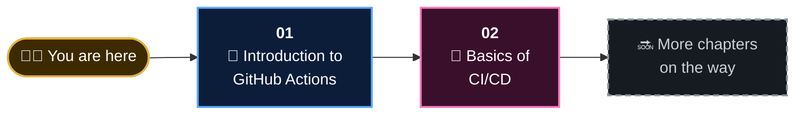
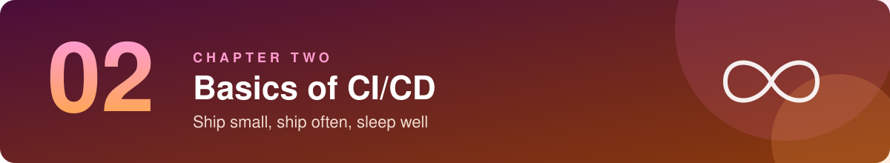

<p align="center">
  
</p>

<p align="center">
  <a href="01-introduction-to-github-actions/01-what-is-github-actions.md"></a>
  
  
  
  
  
</p>

<p align="center">
  <a href=".github/workflows/01-hello-world.yml"></a>
  <a href=".github/workflows/02-ci-basics.yml"></a>
</p>

<h3 align="center">📖 Read it like a book. 🛠️ Run it like a lab. 🤖 Feed it to an agent.</h3>

<p align="center">
  A sequential, story-driven guide that takes you from<br>
  <b>"what is a workflow?"</b> to <b>pipelines you'd trust with production</b>.<br>
  Every example in these pages is a real workflow running in this very repository.
</p>

---

## ✨ Why you'll actually finish this one

| | | |
|:---:|---|---|
| 📚 | **Sequential** | Each lesson builds on the last. No jumping around, no assumed knowledge. |
| 🎨 | **Visual** | Diagrams, tables and colour on every page. Walls of text are banned. |
| 🛠️ | **Hands-on** | Fork the repo and the sample workflows run under *your* account. |
| 💥 | **Break things** | You'll plant bugs on purpose and watch the pipeline catch them. |
| 🧠 | **Sticky** | Checkpoints in every lesson, a quiz and cheat sheet in every chapter. |
| 🤖 | **Agent-ready** | Packaged in the Open Knowledge Format, so AI agents can navigate it too. |

## 🗺️ Your learning path



## 📚 Table of contents

<a href="01-introduction-to-github-actions/01-what-is-github-actions.md"></a>

| # | Lesson | You'll be able to... | ⏱️ |
|:---:|---|---|:---:|
| 1.1 | 🤖 [**What is GitHub Actions?**](01-introduction-to-github-actions/01-what-is-github-actions.md) | Explain it to a colleague in one sentence | 6 min |
| 1.2 | 🧩 [**The Six Core Concepts**](01-introduction-to-github-actions/02-core-concepts.md) | Name every moving part: event, workflow, job, step, action, runner | 8 min |
| 1.3 | 🔬 [**Anatomy of a Workflow File**](01-introduction-to-github-actions/03-anatomy-of-a-workflow.md) | Read any workflow YAML aloud in plain English | 9 min |
| 1.4 | 🚀 [**Your First Workflow**](01-introduction-to-github-actions/04-your-first-workflow.md) 🛠️ | Run, inspect and deliberately break a live workflow | 15 min |
| 1.5 | 📋 [**Cheat Sheet & Quiz**](01-introduction-to-github-actions/05-cheat-sheet-and-quiz.md) | Prove it stuck | 5 min |

<br>

<a href="02-basics-of-ci-cd/01-what-is-ci-cd.md"></a>

| # | Lesson | You'll be able to... | ⏱️ |
|:---:|---|---|:---:|
| 2.1 | 🔄 [**What is CI/CD?**](02-basics-of-ci-cd/01-what-is-ci-cd.md) | Explain why small, frequent releases are safer | 7 min |
| 2.2 | 🧪 [**Continuous Integration**](02-basics-of-ci-cd/02-continuous-integration.md) | Describe what a CI run checks, and the habits behind it | 8 min |
| 2.3 | 🚚 [**Delivery vs Deployment**](02-basics-of-ci-cd/03-delivery-vs-deployment.md) | Finally tell the two CDs apart | 7 min |
| 2.4 | 🏭 [**Anatomy of a Pipeline**](02-basics-of-ci-cd/04-anatomy-of-a-pipeline.md) | Map pipeline stages onto jobs, `needs`, matrices and artifacts | 9 min |
| 2.5 | 🛠️ [**Your First CI Pipeline**](02-basics-of-ci-cd/05-your-first-ci-pipeline.md) 🛠️ | Build a lint → test → package pipeline and watch it catch a bug | 25 min |
| 2.6 | 📋 [**Cheat Sheet & Quiz**](02-basics-of-ci-cd/06-cheat-sheet-and-quiz.md) | Prove it stuck | 5 min |

> [!NOTE]
> 🔜 **This book is still being written.** New chapters land one topic at a time. Watch the repo, or peek at the [change log](log.md).

## ⚡ Live workflows in this repo

These aren't screenshots. They're running right here, and they'll run in your fork too.

| | Workflow | Chapter | What it demonstrates |
|:---:|---|:---:|---|
| 👋 | [`01-hello-world.yml`](.github/workflows/01-hello-world.yml) | [1.4](01-introduction-to-github-actions/04-your-first-workflow.md) | Events, a manual trigger with input, `run` vs `uses`, job summaries |
| 🧪 | [`02-ci-basics.yml`](.github/workflows/02-ci-basics.yml) | [2.5](02-basics-of-ci-cd/05-your-first-ci-pipeline.md) | Staged jobs with `needs`, a version matrix, caching, artifacts |

## 🚀 Get started in 60 seconds

```bash
# 1. Fork this repository on GitHub (top-right corner), then:
git clone https://github.com/<your-username>/github-actions-knowledge-bundle.git
cd github-actions-knowledge-bundle

# 2. Enable workflows: open the Actions tab of your fork and click the green button

# 3. Start reading
```

<p align="center">
  <a href="01-introduction-to-github-actions/01-what-is-github-actions.md"></a>
</p>

> [!TIP]
> **Only have five minutes?** Read [the one-sentence definition](01-introduction-to-github-actions/01-what-is-github-actions.md#-the-one-sentence-definition), then look at [the core concepts picture](01-introduction-to-github-actions/02-core-concepts.md).

## 🧭 What's in the box

```text
📦 github-actions-knowledge-bundle
 ┣ 📄 README.md                            👈 you are here
 ┣ 📄 index.md                             OKF root index (machine-friendly contents)
 ┣ 📄 log.md                               OKF change log
 ┣ 📂 01-introduction-to-github-actions    Chapter 1 lessons
 ┣ 📂 02-basics-of-ci-cd                   Chapter 2 lessons
 ┣ 📂 assets
 ┃  ┣ 📂 images                            diagrams and banners (SVG)
 ┃  ┗ 📂 snippets                          copy-paste YAML
 ┣ 📂 .github/workflows                    the live sample workflows
 ┗ 📂 sample-app                           a tiny app for the pipelines to build
```

## 🧬 Built on the Open Knowledge Format

This repository is an [**OKF v0.2**](https://github.com/GoogleCloudPlatform/knowledge-catalog/blob/main/okf/SPEC.md) knowledge bundle: plain Markdown files with YAML frontmatter that humans can read and agents can navigate.

| OKF element | Here |
|---|---|
| 🧾 **Concept documents** | Every lesson, with `type`, `title`, `description`, `tags`, `sources` and `generated` metadata |
| 🗂️ **`index.md`** | [Root index](index.md), plus one per chapter, for progressive disclosure |
| 🕰️ **`log.md`** | [Change history](log.md), newest first |
| 🔗 **Links** | Ordinary relative Markdown links between concepts |

## 💛 Credits

<table>
  <tr>
    <td align="center" width="50%">
      <a href="https://claude.com/claude-code"></a>
      <br><br>
      <b>Written courtesy of Claude Code</b>
      <br>
      <sub>Anthropic's coding agent, running Claude Opus 5.5</sub>
      <br><br>
      <a href="https://claude.com/claude-code"></a>
    </td>
    <td align="center" width="50%">
      <a href="https://kiro.dev"></a>
      <br><br>
      <b>IDE courtesy of Kiro</b>
      <br>
      <sub>The agentic IDE this bundle was crafted in</sub>
      <br><br>
      <a href="https://kiro.dev"></a>
    </td>
  </tr>
</table>

<p align="center">
  Curated by <a href="https://github.com/bhagatabhijeet"><b>@bhagatabhijeet</b></a>
  &nbsp;·&nbsp;
  Released under <a href="LICENSE">CC0 1.0</a>: copy it, remix it, teach with it.
</p>

<p align="center">
  <b>⭐ If this guide helped you, a star helps the next reader find it.</b>
</p>
